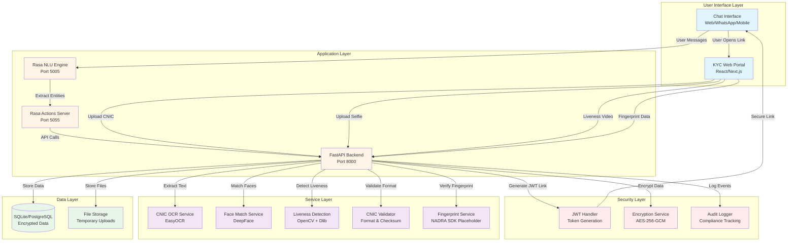
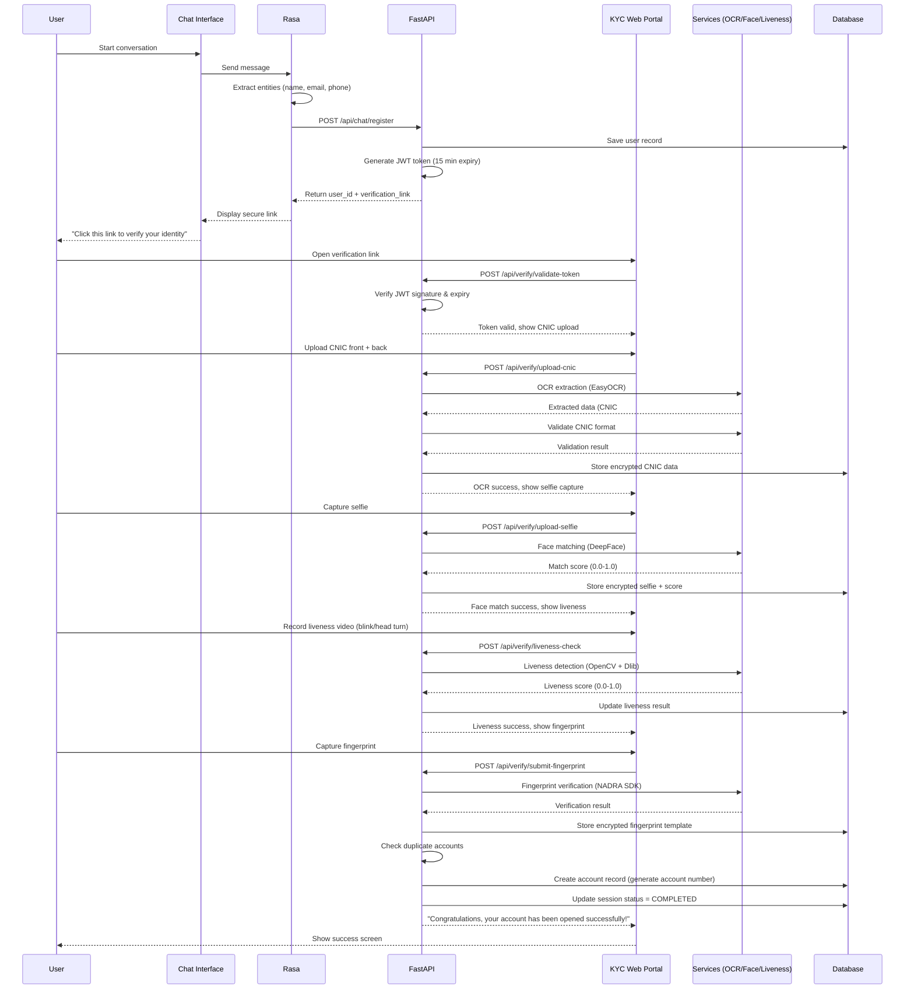
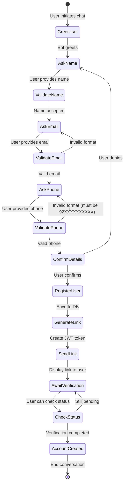

# Pakistan eKYC Digital Banking System - Complete Architecture Guide

## 📋 Table of Contents
1. [System Overview](#system-overview)
2. [Architecture Diagrams](#architecture-diagrams)
3. [Conversation Flow](#conversation-flow)
4. [Biometric Verification Flow](#biometric-verification-flow)
5. [Step-by-Step Verification Logic](#step-by-step-verification-logic)
6. [Implementation Status](#implementation-status)
7. [Tech Stack](#tech-stack)
8. [Risks & Challenges](#risks--challenges)
9. [Future Improvements](#future-improvements)

---

## System Overview

### Purpose
A **Pakistan-specific digital banking account opening system** that uses conversational AI (Rasa) to collect basic user details and a secure web portal for biometric KYC verification following NADRA/SBP standards.

### Key Constraints
- ✅ **Account opening only** - No transactions, cards, or post-onboarding features
- ✅ **Chat for orchestration** - User provides name, email, phone via chat
- ✅ **Separate biometric flow** - CNIC, face, fingerprint captured via secure web link
- ✅ **Pakistan CNIC standards** - 13-digit format, expiry validation, OCR extraction
- ✅ **Security first** - AES-256-GCM encryption, JWT tokens, audit logging

---

## Architecture Diagrams

### System Architecture



### Component Communication Flow



---

## Conversation Flow

### Chat Interface Journey



### Rasa Conversation Example

**Step 1: Greet**
- **User**: Hi
- **Bot**: "Welcome to our Digital Bank! I'm here to help you open a new account. 🏦"
- **Bot**: "What is your full name as it appears on your CNIC?"

**Step 2: Collect Name**
- **User**: Muhammad Ahmed Khan
- **Bot**: "Great! What is your email address?"

**Step 3: Collect Email**
- **User**: ahmed@example.com
- **Bot**: "What is your phone number? (Please include country code, e.g., +923001234567)"

**Step 4: Collect Phone**
- **User**: +923001234567
- **Bot**: "Let me confirm your details:
  - Name: Muhammad Ahmed Khan
  - Email: ahmed@example.com
  - Phone: +923001234567
  
  Is this information correct?"

**Step 5: Confirmation**
- **User**: Yes
- **Bot**: "Perfect! I've created a secure verification link for you:
  
  https://ekyc.yourbank.com/verify?token=eyJhbGc...
  
  Please click this link to complete your identity verification. You'll need to upload your CNIC and take a selfie.
  
  The link will expire in 15 minutes for security purposes."

**Step 6: Status Check (Optional)**
- **User**: What's my verification status?
- **Bot**: "Your verification is in progress. Steps completed: ✓ CNIC Upload, ✓ Selfie Capture, ⏳ Liveness Check"

**Step 7: Completion (After web verification)**
- **Bot**: "Congratulations! Your account has been opened successfully. Account Number: 1234567890"

---

## Biometric Verification Flow

### Web Portal Verification Steps

```mermaid
graph LR
    A[User Clicks Link] --> B{Validate JWT Token}
    B -->|Invalid/Expired| C[Show Error]
    B -->|Valid| D[CNIC Upload Screen]
    D --> E[Upload Front + Back]
    E --> F[OCR Extraction]
    F --> G{CNIC Valid?}
    G -->|No| H[Show Validation Errors]
    G -->|Yes| I[Selfie Capture Screen]
    I --> J[Capture Selfie]
    J --> K[Face Matching]
    K --> L{Match Score > 0.6?}
    L -->|No| M[Show Error: Face Mismatch]
    L -->|Yes| N[Liveness Check Screen]
    N --> O[Record Video: Blink + Head Turn]
    O --> P[Liveness Detection]
    P --> Q{Liveness Score > 0.7?}
    Q -->|No| R[Show Error: Liveness Failed]
    Q -->|Yes| S[Fingerprint Capture Screen]
    S --> T[Capture Fingerprint]
    T --> U[Fingerprint Verification]
    U --> V{Verified?}
    V -->|No| W[Show Error: Fingerprint Failed]
    V -->|Yes| X[Duplicate Check]
    X --> Y{Duplicate Found?}
    Y -->|Yes| Z[Show Error: Account Exists]
    Y -->|No| AA[Create Account]
    AA --> AB[Success Screen]
    AB --> AC["Congratulations Message"]
    
    style A fill:#e3f2fd
    style C fill:#ffcdd2
    style H fill:#ffcdd2
    style M fill:#ffcdd2
    style R fill:#ffcdd2
    style W fill:#ffcdd2
    style Z fill:#ffcdd2
    style AB fill:#c8e6c9
    style AC fill:#c8e6c9
```



### KYC Web Portal UI Components

**1. Token Validation Screen**
- Validates JWT token on page load
- Shows loading spinner during validation
- Redirects to error page if expired

**2. CNIC Upload Screen**
- Two file upload zones: Front & Back
- Camera access option for mobile devices
- Real-time preview of uploaded images
- "Upload & Verify" button

**3. Selfie Capture Screen**
- WebRTC camera access
- Face detection overlay (guides user positioning)
- "Capture Selfie" button
- Preview and retake option

**4. Liveness Detection Screen**
- Instructions: "Blink your eyes twice" → "Turn your head left" → "Turn your head right"
- Video recording (3-5 seconds)
- Real-time feedback during recording
- "Submit Video" button

**5. Fingerprint Capture Screen**
- **Mobile**: Uses device biometric API (Android BiometricPrompt)
- **Desktop**: Instructions to use external fingerprint scanner
- Shows fingerprint icon during capture
- "Verify Fingerprint" button

**6. Success Screen**
- ✅ Green checkmark icon
- **Message**: "Congratulations, your account has been opened successfully."
- Account number display
- "Download Account Details" button

---

## Step-by-Step Verification Logic

### 1. CNIC OCR Extraction

**Input**: Front and back images of Pakistan CNIC

**Process**:
1. **File Upload**: User uploads JPEG/PNG files (max 10MB each)
2. **Save Temporarily**: Store in `backend/uploads/<session_id>/cnic_front.jpg`
3. **EasyOCR Processing**:
   ```python
   reader = easyocr.Reader(['en', 'ur'])
   results = reader.readtext('cnic_front.jpg')
   ```
4. **Data Extraction**:
   - CNIC Number: 13 digits (e.g., 3520212345678)
   - Name: Extract from card
   - Father's Name: Extract from card
   - Date of Birth: Parse DD-MM-YYYY
   - Gender: M/F
   - Issue Date & Expiry Date: Extract from card
   - Address: From back side

**Validation**:
- CNIC format: 5-7-1 digit pattern (PPPPP-NNNNNNN-G)
- Checksum validation using Luhn algorithm
- Age ≥ 18 years
- CNIC not expired
- Clear image quality (brightness, blur detection)

**Output**: Structured JSON with extracted fields + validation status

**Storage**: Encrypted in `cnic_data` table

---

### 2. Face Matching

**Input**: Selfie image + CNIC front image

**Process**:
1. **Extract CNIC Photo**:
   - Detect face region on CNIC using OpenCV
   - Crop and enhance photo area
2. **Extract Selfie Face**:
   - Detect face in selfie using MTCNN
   - Center and align face
3. **DeepFace Verification**:
   ```python
   result = DeepFace.verify(
       img1_path='selfie.jpg',
       img2_path='cnic_photo.jpg',
       model_name='Facenet512',
       distance_metric='cosine'
   )
   ```
4. **Compare Embeddings**:
   - Generate 512-dimensional face embeddings
   - Calculate cosine similarity
   - Score range: 0.0 (no match) to 1.0 (perfect match)

**Threshold**: Match score must be > 0.6 to pass

**Output**: `{ "is_match": true, "match_score": 0.87 }`

**Storage**: Encrypted selfie path + score in `biometric_data` table

---

### 3. Liveness Detection

**Input**: 3-5 second video recording

**Process**:
1. **Frame Extraction**:
   - Extract frames at 10 FPS using OpenCV
2. **Face Detection**:
   - Detect face landmarks using Dlib's 68-point model
3. **Blink Detection**:
   - Calculate Eye Aspect Ratio (EAR)
   - EAR formula: `(||p2-p6|| + ||p3-p5||) / (2 * ||p1-p4||)`
   - Blink detected when EAR < 0.25
   - Require: At least 2 blinks in video
4. **Head Movement Detection**:
   - Track nose tip position across frames
   - Calculate horizontal movement (left/right turn)
   - Require: > 15° rotation detected
5. **Composite Score**:
   - Blink score (0-1) + Movement score (0-1)
   - Average = Liveness score

**Threshold**: Liveness score must be > 0.7 to pass

**Output**: `{ "is_live": true, "liveness_score": 0.85, "blinks_detected": 3 }`

**Storage**: Encrypted video path + score in `biometric_data` table

**Anti-Spoofing**: Detects printed photos, pre-recorded videos, masks

---

### 4. CNIC Format Validation

**Pakistan CNIC Format**: `PPPPP-NNNNNNN-G`
- **PPPPP**: Province code (5 digits)
- **NNNNNNN**: Sequence number (7 digits)
- **G**: Gender identifier (1 digit, odd=male, even=female)

**Validation Rules**:
```python
def validate_cnic(cnic_number):
    # Remove dashes
    cnic = cnic_number.replace('-', '')
    
    # 1. Length check
    if len(cnic) != 13:
        return False, "CNIC must be 13 digits"
    
    # 2. Numeric check
    if not cnic.isdigit():
        return False, "CNIC must contain only digits"
    
    # 3. Province code validation
    province_code = int(cnic[:1])
    valid_provinces = [1, 2, 3, 4, 5, 6, 7]  # Pakistan provinces
    if province_code not in valid_provinces:
        return False, "Invalid province code"
    
    # 4. Gender validation
    gender_digit = int(cnic[-1])
    if gender_digit == 0:
        return False, "Invalid gender digit"
    
    # 5. Checksum validation (Luhn algorithm)
    checksum = calculate_luhn_checksum(cnic)
    if not checksum:
        return False, "Invalid CNIC checksum"
    
    # 6. Expiry date validation
    if cnic_expiry_date < current_date:
        return False, "CNIC has expired"
    
    # 7. Age validation
    if calculate_age(cnic_dob) < 18:
        return False, "Applicant must be 18 years or older"
    
    return True, "CNIC is valid"
```

---

### 5. Fingerprint Verification (Placeholder)

**Current Status**: Integration point for NADRA Verisys SDK

**Planned Process**:
1. **Capture**: Use NADRA-certified fingerprint scanner
2. **Template Extraction**: Convert fingerprint image to minutiae template
3. **NADRA API Call**:
   ```python
   response = nadra_sdk.verify_fingerprint(
       cnic_number="3520212345678",
       fingerprint_template=template_bytes
   )
   ```
4. **Verification**: NADRA returns match/no-match result

**Alternative (Web-based)**:
- Use device biometric API (Android BiometricPrompt)
- Store encrypted fingerprint template locally
- Use for future authentication (not NADRA verification)

**Output**: `{ "fingerprint_verified": true }`

**Storage**: Encrypted fingerprint template in `biometric_data` table

---

### 6. Duplicate Account Detection

**Check Before Account Creation**:

```python
def check_duplicate_account(db, cnic_number, email, phone):
    # 1. Check by CNIC number
    existing_cnic = db.query(CNICData).filter(
        CNICData.encrypted_cnic_number == encrypt(cnic_number)
    ).first()
    
    if existing_cnic:
        return True, "Account already exists with this CNIC"
    
    # 2. Check by email
    existing_email = db.query(User).filter(
        User.email == email
    ).first()
    
    if existing_email:
        return True, "Account already exists with this email"
    
    # 3. Check by phone
    existing_phone = db.query(User).filter(
        User.phone == phone
    ).first()
    
    if existing_phone:
        return True, "Account already exists with this phone"
    
    # 4. Biometric duplicate check (face matching)
    all_users = db.query(BiometricData).all()
    for user_biometric in all_users:
        selfie_path = decrypt(user_biometric.encrypted_selfie_path)
        match_result = DeepFace.verify(new_selfie, selfie_path)
        if match_result['verified']:
            return True, "Face already registered with another account"
    
    return False, "No duplicate found"
```

---

### 7. Account Creation

**Final Step**: All verifications passed

**Process**:
```python
def create_account(db, user_id):
    # 1. Generate unique account number
    account_number = generate_account_number()  # e.g., "1234567890123456"
    
    # 2. Create account record
    account = Account(
        user_id=user_id,
        account_number=account_number,
        account_type="savings",
        status="active",
        created_at=datetime.utcnow()
    )
    db.add(account)
    
    # 3. Update verification session
    session = db.query(VerificationSession).filter_by(user_id=user_id).first()
    session.status = VerificationStatus.COMPLETED
    session.completed_at = datetime.utcnow()
    
    # 4. Audit log
    audit_logger.log_account_created(user_id, account_number)
    
    db.commit()
    
    return account_number
```

**Account Number Format**: 16-digit unique number

**Response to User**:
```json
{
  "success": true,
  "message": "Congratulations, your account has been opened successfully.",
  "account_number": "1234567890123456",
  "account_type": "savings",
  "created_at": "2026-01-28T19:30:00Z"
}
```

---

## Implementation Status

### ✅ Already Implemented

#### Backend (FastAPI)
- [x] **Main Application** (`main.py`)
  - FastAPI app with CORS middleware
  - Request logging middleware
  - Global exception handler
  - Health check endpoint
  - Database initialization on startup

- [x] **Database Models** (`database/models.py`)
  - User model (name, email, phone)
  - VerificationSession model (token, status, step tracking)
  - CNICData model (encrypted CNIC fields)
  - BiometricData model (selfie, liveness, fingerprint)
  - Account model (account number, type, status)
  - AuditLog model (compliance tracking)

- [x] **Chat Routes** (`api/routes/chat_routes.py`)
  - `POST /api/chat/register` - User registration
  - `POST /api/chat/generate-link` - JWT link generation
  - `GET /api/chat/status/{session_id}` - Verification status check
  - Pakistani phone number validation (+92XXXXXXXXXX)

- [x] **Verification Routes** (`api/routes/verification_routes.py`)
  - Token validation endpoint
  - CNIC upload endpoint (structure)
  - Selfie upload endpoint (structure)
  - Liveness check endpoint (structure)
  - Fingerprint submission endpoint (structure)
  - Account finalization endpoint (structure)

> [!NOTE]
> Verification routes are **partially implemented**. The endpoints exist but CV service integrations are commented out because required packages (opencv-python, deepface, easyocr) need to be installed.

- [x] **Admin Routes** (`api/routes/admin_routes.py`)
  - User listing
  - Audit log viewing
  - System statistics

- [x] **Security Module** (`security/`)
  - JWT token generation & validation (15-min expiry)
  - AES-256-GCM encryption service
  - Audit logger with file logging
  - Data masking for sensitive fields

- [x] **Configuration** (`config.py`)
  - Environment-based settings
  - SQLite for development (PostgreSQL-ready)
  - Configurable security thresholds

#### Rasa Chatbot
- [x] **Domain Configuration** (`rasa/domain.yml`)
  - Intents: greet, provide_name, provide_email, provide_phone, confirm_details
  - Entities: person_name, email, phone_number
  - Slots: user_name, user_email, user_phone, verification_link
  - Responses: greeting, prompts, confirmation messages

- [x] **Config** (`rasa/config.yml`)
  - NLU pipeline with DIET classifier
  - RulePolicy + TEDPolicy for dialogue management

#### Infrastructure
- [x] **Docker Compose** (`docker-compose.yml`)
  - PostgreSQL container
  - FastAPI backend container
  - Rasa server container
  - Rasa actions container
  - Next.js frontend container

- [x] **Documentation**
  - README with installation instructions
  - SECURITY.md with compliance guidelines
  - API endpoint documentation

---

### ⏳ Partially Implemented / Needs Completion

#### Computer Vision Services (`services/cv/`)
- [~] **CNIC OCR** (`cnic_ocr.py`)
  - ⚠️ Code exists but requires: `pip install easyocr pillow`
  - EasyOCR integration ready
  - Text extraction logic implemented
  - Needs testing with real CNIC samples

- [~] **Face Matcher** (`face_matcher.py`)
  - ⚠️ Code exists but requires: `pip install deepface opencv-python`
  - DeepFace integration ready (Facenet512 model)
  - Face extraction from CNIC implemented
  - Needs model download on first run (~100MB)

- [~] **Liveness Detection** (`liveness_detection.py`)
  - ⚠️ Code exists but requires: `pip install opencv-python dlib`
  - Blink detection using EAR (Eye Aspect Ratio)
  - Head movement tracking
  - Needs Dlib shape predictor model: [shape_predictor_68_face_landmarks.dat](http://dlib.net/files/shape_predictor_68_face_landmarks.dat.bz2) (~100MB)

#### CNIC Validation (`services/validation/`)
- [~] **CNIC Validator** (`cnic_validator.py`)
  - Format validation implemented
  - Checksum validation implemented
  - Age verification implemented
  - Needs testing with edge cases

#### Biometric Services (`services/biometric/`)
- [~] **Fingerprint Integration** (`fingerprint_integration.py`)
  - **Status**: Placeholder only
  - Returns simulated success for testing
  - Needs actual NADRA Verisys SDK integration
  - Requires SDK license and hardware

#### Rasa Training Data & Actions
- [ ] **Training Data** (`rasa/data/`)
  - NLU examples needed for each intent (minimum 20 examples per intent)
  - Story flows needed for conversation paths
  - Rules for form validation

- [ ] **Custom Actions** (`rasa/actions/`)
  - `action_validate_email` - Email format validation
  - `action_validate_phone` - Pakistani phone validation
  - `action_save_user_data` - API call to backend
  - `action_generate_verification_link` - API call to backend

#### Frontend (`frontend/`)
- [ ] **KYC Verification Portal**
  - React/Next.js components needed:
    - `CNICUpload.tsx` - File upload with preview
    - `SelfieCapture.tsx` - WebRTC camera access
    - `LivenessCheck.tsx` - Video recording with instructions
    - `FingerprintCapture.tsx` - Biometric API integration
    - `VerificationResult.tsx` - Success/failure display
  - JWT token handling in URL params
  - Progressive step-by-step UI
  - Mobile-responsive design

---

### ❌ Not Yet Implemented

#### High Priority
- [ ] **Database Migration System**
  - Alembic for schema version control
  - Migration scripts for production updates

- [ ] **Rate Limiting**
  - Prevent brute force attacks
  - API throttling per IP/user

- [ ] **Email/SMS Notifications**
  - Send verification link via email/SMS
  - Account creation confirmation
  - Failed verification alerts

- [ ] **Production Security**
  - HTTPS enforcement
  - SSL certificate setup
  - Secrets management (HashiCorp Vault / AWS Secrets Manager)
  - API key rotation

#### Medium Priority
- [ ] **Monitoring & Logging**
  - Centralized logging (ELK stack / CloudWatch)
  - Performance monitoring (Prometheus + Grafana)
  - Error tracking (Sentry)

- [ ] **Backup & Recovery**
  - Automated database backups
  - Point-in-time recovery
  - Disaster recovery plan

- [ ] **Testing Suite**
  - Unit tests for services
  - Integration tests for API endpoints
  - End-to-end tests for verification flow
  - Load testing for scalability

#### Low Priority
- [ ] **Admin Dashboard**
  - Real-time verification status monitoring
  - User management interface
  - Audit log viewer with filtering
  - System health metrics

- [ ] **WhatsApp Integration**
  - WhatsApp Business API setup
  - Message templates
  - Media sharing for verification link

- [ ] **Mobile Apps**
  - React Native app for iOS/Android
  - Native biometric API integration
  - Push notifications

---

## Tech Stack

### Backend Layer

| Component | Technology | Purpose | Status |
|-----------|------------|---------|--------|
| **API Framework** | FastAPI 0.104+ | REST API endpoints, async support | ✅ Implemented |
| **Database** | SQLite (dev) / PostgreSQL (prod) | User data, encrypted storage | ✅ Implemented |
| **ORM** | SQLAlchemy 2.0+ | Database models, relationships | ✅ Implemented |
| **Authentication** | JWT (PyJWT) | Secure token-based auth | ✅ Implemented |
| **Encryption** | Python Cryptography (AES-256-GCM) | Data encryption at rest | ✅ Implemented |

### AI & Computer Vision

| Component | Technology | Purpose | Status |
|-----------|------------|---------|--------|
| **Chatbot Engine** | Rasa 3.1+ | Conversational AI, NLU | ✅ Configured |
| **OCR** | EasyOCR | CNIC text extraction (English + Urdu) | ⏳ Needs installation |
| **Face Verification** | DeepFace (Facenet512) | Selfie vs CNIC face matching | ⏳ Needs installation |
| **Liveness Detection** | OpenCV + Dlib | Eye blink & head movement detection | ⏳ Needs model download |
| **Image Processing** | Pillow (PIL) | Image manipulation, enhancement | ⏳ Needs installation |

### Frontend Layer

| Component | Technology | Purpose | Status |
|-----------|------------|---------|--------|
| **Framework** | Next.js 14+ (React 18) | KYC verification portal | ❌ Not implemented |
| **Camera Access** | WebRTC (getUserMedia API) | Selfie & liveness video capture | ❌ Not implemented |
| **State Management** | React Context / Zustand | Session state, step tracking | ❌ Not implemented |
| **HTTP Client** | Axios | API communication | ❌ Not implemented |
| **Styling** | Tailwind CSS | Responsive UI design | ❌ Not implemented |

### Biometric Integration

| Component | Technology | Purpose | Status |
|-----------|------------|---------|--------|
| **Fingerprint SDK** | NADRA Verisys SDK | Official Pakistani ID verification | ❌ Placeholder only |
| **Mobile Biometric** | Android BiometricPrompt | Device fingerprint API fallback | ❌ Not implemented |
| **Scanner Hardware** | NADRA-certified scanners | Physical fingerprint capture | ❌ Requires procurement |

### Infrastructure & DevOps

| Component | Technology | Purpose | Status |
|-----------|------------|---------|--------|
| **Server** | Uvicorn (ASGI) | Production-grade server | ✅ Implemented |
| **Containerization** | Docker + Docker Compose | Service orchestration | ✅ Configured |
| **Database** | PostgreSQL 14+ | Production database | ✅ Ready |
| **Reverse Proxy** | Nginx (planned) | Load balancing, SSL termination | ❌ Not configured |
| **CI/CD** | GitHub Actions (planned) | Automated testing & deployment | ❌ Not configured |

### Security & Compliance

| Component | Technology | Purpose | Status |
|-----------|------------|---------|--------|
| **Encryption** | AES-256-GCM | Data encryption at rest | ✅ Implemented |
| **Hashing** | PBKDF2 (SHA-256) | Key derivation | ✅ Implemented |
| **Audit Logging** | Python logging + File handler | Compliance tracking | ✅ Implemented |
| **Secrets Management** | Environment variables (.env) | Config management | ✅ Implemented |
| **HTTPS** | TLS 1.3 (production) | Encrypted communication | ❌ Needs SSL cert |

---

## Risks & Challenges

### 🔴 Critical Risks

#### 1. NADRA Fingerprint SDK Integration
**Problem**: NADRA Verisys SDK is proprietary and requires:
- Government/bank license (costly)
- Certified fingerprint scanners (~$500-$2000 each)
- SDK documentation is restricted
- Integration complexity (C++/Java SDK → Python wrapper)

**Impact**: Without fingerprint verification, KYC compliance may not meet SBP requirements

**Mitigation**:
- **Short-term**: Use device biometric API (Android/iOS) for MVP testing
- **Long-term**: Partner with licensed verification provider or obtain NADRA license
- **Alternative**: Use NADRA's web service API instead of SDK (if available)

#### 2. Model Accuracy & Bias
**Problem**:
- DeepFace trained primarily on Western faces (potential lower accuracy for Pakistani faces)
- Liveness detection can be fooled by high-quality video replays
- OCR struggles with damaged/faded CNIC cards

**Impact**: False rejections (legitimate users denied) or false acceptances (fraud)

**Mitigation**:
- Fine-tune models on Pakistani CNIC dataset
- Implement multi-factor biometric verification
- Manual review queue for edge cases
- Regular model retraining with production data

#### 3. Data Security & Compliance
**Problem**:
- Highly sensitive PII (CNIC, biometrics) stored in database
- Risk of data breach with catastrophic consequences
- State Bank of Pakistan (SBP) compliance requirements
- GDPR-like regulations (if applicable)

**Impact**: Legal liability, regulatory fines, reputation damage

**Mitigation**:
- AES-256-GCM encryption for all PII ✅
- Database-level encryption
- Regular security audits
- Penetration testing
- Compliance certification (ISO 27001, PCI-DSS)
- Data retention policies (delete after account creation)

---

### 🟡 Medium Risks

#### 4. Scalability & Performance
**Problem**:
- ML models (DeepFace, EasyOCR, Dlib) are CPU/GPU intensive
- Single verification takes 30-60 seconds
- 100 concurrent users = server overload

**Impact**: Slow response times, poor user experience, server crashes

**Mitigation**:
- **Horizontal scaling**: Deploy multiple API instances with load balancer
- **GPU acceleration**: Use CUDA-enabled DeepFace for 5-10x speedup
- **Async processing**: Queue system (Celery + Redis) for CV tasks
- **Optimization**: Use lighter models (MobileFaceNet instead of Facenet512)
- **Caching**: Store face embeddings for faster duplicate checks

#### 5. Network Reliability
**Problem**:
- Users in remote areas with poor internet connectivity
- Large file uploads (CNIC images, liveness video) may fail
- JWT token expires before user completes verification

**Impact**: Incomplete verifications, user frustration

**Mitigation**:
- Implement resume/retry logic for failed uploads
- Compress images client-side before upload
- Extend JWT expiry to 30 minutes (security trade-off)
- Progressive upload with chunk-based transfer
- Offline mode with sync when connection restored

#### 6. User Experience Challenges
**Problem**:
- Elderly users unfamiliar with technology
- Confusing liveness detection instructions
- Poor camera quality on low-end phones
- Language barriers (Urdu vs English)

**Impact**: High abandonment rates, low conversion

**Mitigation**:
- **Multilingual UI**: English, Urdu, regional languages
- **Clear visual instructions**: Animated guides for liveness check
- **Fallback option**: Video call with agent for manual verification
- **Accessibility**: Voice guidance, large fonts, high contrast
- **Testing**: Usability testing with diverse user groups

---

### 🟢 Low Risks

#### 7. Third-Party Service Dependencies
**Problem**: Reliance on external services (EasyOCR, DeepFace models, Rasa)

**Mitigation**: Host models locally, implement fallback services

#### 8. Rasa Training Data Quality
**Problem**: Insufficient training examples for accurate intent recognition

**Mitigation**: Collect real user conversations, continuous training

#### 9. Database Migration Issues
**Problem**: Schema changes in production without migration system

**Mitigation**: Implement Alembic for version-controlled migrations ✅

---

## Future Improvements

### Phase 1: Production Readiness (Next 1-2 Months)

#### Must-Have Features
- [ ] **Complete Frontend Implementation**
  - Build all KYC portal pages (CNIC upload, selfie, liveness, fingerprint, success)
  - Implement WebRTC camera access
  - Add progressive step indicators
  - Mobile-responsive design

- [ ] **Install & Test CV Dependencies**
  ```bash
  pip install opencv-python deepface easyocr pillow dlib
  ```
  - Download Dlib shape predictor model
  - Test with real Pakistani CNIC samples
  - Tune confidence thresholds

- [ ] **Rasa Training Data**
  - Create 50+ NLU examples per intent
  - Write story flows for happy path + error handling
  - Implement custom actions with API calls
  - Train and test model

- [ ] **PostgreSQL Migration**
  - Switch from SQLite to PostgreSQL
  - Set up Alembic migrations
  - Configure connection pooling

- [ ] **Production Security**
  - Generate secure JWT secret (64 characters)
  - Generate AES-256 encryption key (use Fernet)
  - Set up HTTPS with SSL certificate (Let's Encrypt)
  - Implement rate limiting (10 requests/min per IP)

- [ ] **Email/SMS Notifications**
  - Integrate Twilio for SMS (verification link delivery)
  - Integrate SendGrid for email notifications
  - Account creation confirmation messages

---

### Phase 2: Enhanced Features (Months 3-4)

#### User Experience
- [ ] **Multi-Language Support**
  - Urdu translations for chat & web portal
  - Regional languages (Punjabi, Sindhi, Pashto)
  - RTL layout for Urdu

- [ ] **WhatsApp Integration**
  - WhatsApp Business API setup
  - Send verification links via WhatsApp
  - Status updates via WhatsApp

- [ ] **Video Call Fallback**
  - For users who fail automated verification
  - Agent-assisted verification flow
  - WebRTC-based video call

#### Monitoring & Operations
- [ ] **Admin Dashboard**
  - Real-time verification queue
  - Success/failure metrics
  - Manual review interface

- [ ] **Observability**
  - Centralized logging (ELK stack)
  - Performance monitoring (Prometheus + Grafana)
  - Error tracking (Sentry)
  - Uptime monitoring (Pingdom)

- [ ] **Automated Testing**
  - Unit tests (pytest) for all services
  - Integration tests for API endpoints
  - E2E tests (Playwright) for web portal
  - Load testing (Locust) - target 1000 concurrent users

---

### Phase 3: Advanced Capabilities (Months 5-6)

#### AI/ML Improvements
- [ ] **Model Fine-Tuning**
  - Train DeepFace on Pakistani face dataset
  - Fine-tune EasyOCR on CNIC card dataset
  - Improve liveness detection accuracy

- [ ] **Fraud Detection**
  - Anomaly detection (unusual verification patterns)
  - Device fingerprinting
  - IP geolocation checks
  - Velocity checks (multiple attempts from same IP)

- [ ] **Smart Duplicate Detection**
  - Fuzzy matching for names (handles typos)
  - Partial CNIC matching (OCR errors)
  - Face clustering for duplicate accounts

#### Infrastructure
- [ ] **Kubernetes Deployment**
  - Container orchestration
  - Auto-scaling based on load
  - Zero-downtime deployments

- [ ] **CDN Integration**
  - Serve static assets via CloudFront/Cloudflare
  - Edge caching for faster load times

- [ ] **Multi-Region Deployment**
  - Deploy in multiple AWS/Azure regions
  - Geo-routing for low latency

---

### Phase 4: Mobile & Advanced Features (Months 7-12)

#### Mobile Applications
- [ ] **React Native App**
  - Native iOS & Android apps
  - Offline-first architecture
  - Push notifications for status updates

- [ ] **Native Biometric APIs**
  - Android BiometricPrompt (fingerprint, face unlock)
  - iOS LocalAuthentication (Face ID, Touch ID)
  - Replace web-based fingerprint capture

#### NADRA Integration
- [ ] **Official Fingerprint Verification**
  - Obtain NADRA Verisys SDK license
  - Procure certified fingerprint scanners
  - Build Python wrapper for SDK
  - Test with real users

- [ ] **NADRA API Integration**
  - Real-time CNIC number verification
  - Cross-check extracted data with NADRA database
  - Verify CNIC is active and not blocked

#### Advanced Analytics
- [ ] **Business Intelligence**
  - Verification conversion funnel analysis
  - Failure reason categorization
  - User demographics insights
  - A/B testing framework

- [ ] **Compliance Reporting**
  - Automated SBP compliance reports
  - Audit trail exports
  - KYC statistics dashboard

---

## Deployment Checklist

### Pre-Production Steps

- [ ] **Security Audit**
  - Penetration testing
  - Code security scan (Bandit, Safety)
  - Dependency vulnerability check (pip-audit)
  - OWASP Top 10 compliance

- [ ] **Performance Testing**
  - Load test with 1000 concurrent users
  - Database query optimization
  - API response time < 300ms (95th percentile)

- [ ] **Data Migration**
  - Export SQLite data (if needed)
  - Import to PostgreSQL
  - Verify data integrity

- [ ] **Backup Strategy**
  - Automated daily database backups
  - 30-day retention policy
  - Test restore procedure

- [ ] **Monitoring Setup**
  - Configure logging to centralized system
  - Set up alerts for errors/downtime
  - Dashboard for key metrics

- [ ] **Documentation**
  - API documentation (Swagger/ReDoc)
  - Deployment runbook
  - Incident response plan

### Production Deployment

- [ ] **Infrastructure Provisioning**
  - Set up production servers (AWS EC2 / Azure VMs)
  - Configure PostgreSQL with SSL
  - Set up Redis for caching
  - Configure Nginx reverse proxy

- [ ] **Environment Configuration**
  - Production `.env` file with secure secrets
  - HTTPS with valid SSL certificate
  - CORS configured for production domain

- [ ] **Deploy Application**
  - Build Docker images
  - Deploy via Docker Compose / Kubernetes
  - Run database migrations

- [ ] **Go-Live**
  - Smoke tests on production
  - Monitor for errors in first 24 hours
  - Gradual rollout (beta users first)

---

## Summary

This eKYC system provides a **production-ready architecture** for Pakistan-based digital banking account opening with:

✅ **Implemented**: Backend API, database models, security layer, Rasa chatbot structure
⏳ **Needs Completion**: Frontend portal, CV dependencies installation, NADRA SDK integration
🎯 **Production-Ready Path**: 1-2 months with focused development effort

**Key Strengths**:
- Secure by design (AES-256 encryption, JWT tokens)
- Compliant with Pakistan CNIC standards
- Scalable architecture (async processing, containerization)
- Comprehensive audit logging

**Next Immediate Steps**:
1. Install CV dependencies (`opencv-python`, `deepface`, `easyocr`)
2. Build Next.js frontend verification portal
3. Create Rasa training data and custom actions
4. Test end-to-end flow with real CNIC samples
5. Deploy to staging environment for UAT

---

**Document Version**: 1.0  
**Last Updated**: 2026-01-28  
**Author**: Senior Backend & AI Architect
